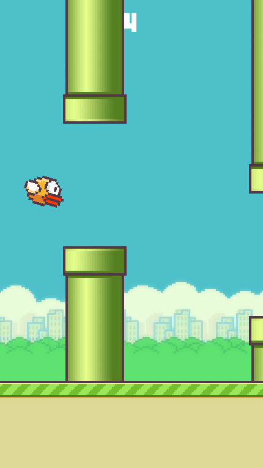

# Flappy Bird SDL2 Clone

A Flappy Bird clone written in C using SDL2.

## Screenshot



## Features

1. Hardware-accelerated rendering
2. Score
3. Game over screen and restart
4. Menu
5. Adaptive window scaling using SDL logical resolution
6. Delta-time based movement and physics

## Controls

### In Menu

* Start: `ENTER`
* Close Window: `ESCAPE`

### In Game

* Jump: `SPACE/LMB`
* Close Window: `ESCAPE`

### In Game Over

* Restart: `R`
* Close Window: `ESCAPE`

## Building

#### Requirements (Debian/Ubuntu)

```bash
sudo apt update

sudo apt install \
    build-essential \
    cmake \
    libsdl2-dev \
    libsdl2-image-dev \
    libsdl2-ttf-dev \
    libsdl2-mixer-dev
```

#### Clone Repo

```bash
git clone https://github.com/davydtovstyj/Flappy-Bird-SDL2.git

cd Flappy-Bird-SDL2
```

#### Configure the project

```bash
cmake -S . -B build
```

#### Build into build folder

```bash
cmake --build build/
```

## Assets

_From [this](https://github.com/samuelcust/flappy-bird-assets) repo_
